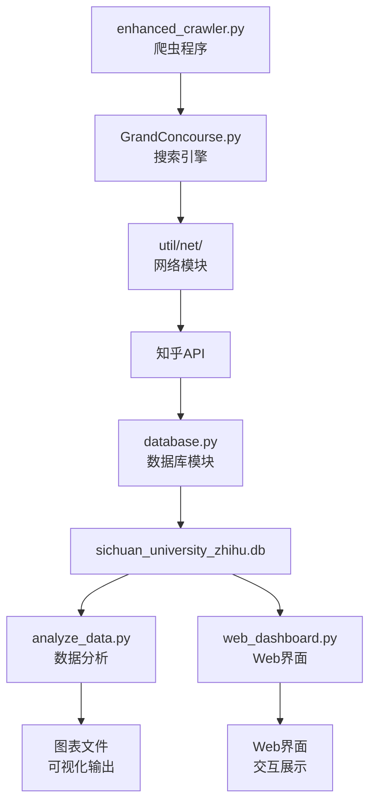

# 知乎数据爬虫项目

## 🎯 项目概述

本项目是一个专门针对四川大学相关内容的知乎数据采集与分析系统，采用 Python 开发，具备数据爬取、存储、分析和可视化展示功能。

## ⚖️ 版权声明与使用条款

### 📜 使用许可
本项目**仅供个人学习和技术研究使用**，严禁用于商业用途。

### 🚫 禁止行为
- ❌ 商业化使用或盈利
- ❌ 大规模数据采集影响网站正常运行
- ❌ 违反知乎用户协议和相关法律法规
- ❌ 未经授权的数据转售或分发

### ✅ 允许行为
- ✅ 个人学习和技术研究
- ✅ 学术研究和教育用途
- ✅ 代码学习和技术交流
- ✅ 非商业性的数据分析

### 📚 项目来源
本项目在 [Foxgeek36/ZhihuSpider](https://github.com/Foxgeek36/ZhihuSpider) 的基础上进行了**重大改造和升级**，主要改进包括：

| 改进方面 | 原项目 | 本项目升级 |
|----------|--------|------------|
| **反爬虫机制** | 基础延时 | 智能动态延时 + 多层防护 |
| **数据存储** | 简单存储 | 完整的 SQLite 数据库设计 |
| **数据分析** | 无 | 完整的数据分析和可视化系统 |
| **Web界面** | 无 | 交互式 Dashboard + 图表展示 |
| **系统架构** | 单一脚本 | 模块化架构 + 工具库 |
| **数据量级** | 小规模 | 支持 10万+ 级别数据采集 |

**致谢**：感谢原作者 [Foxgeek36](https://github.com/Foxgeek36) 提供的基础框架和灵感。

### 🛡️ 免责声明
- 用户使用本项目产生的任何法律责任由用户自行承担
- 请严格遵守知乎网站的用户协议
- 建议合理控制采集频率，避免对目标网站造成压力

## 👥 项目团队

| 成员 | 主要职责 | 负责模块 |
|------|----------|----------|
| **周子然** | 🕷️ 爬虫架构师 | 数据采集、反爬虫机制、数据库设计 |
| **肖启蒙** | 📊 数据分析师 | 数据分析、可视化、Web界面开发 |

### 📋 详细分工

#### 🕷️ 周子然 - 爬虫架构师
- **核心爬虫程序**: `enhanced_crawler.py` - 主爬虫逻辑和反爬虫机制
- **搜索引擎**: `GrandConcourse.py` - 数据搜索和采集功能
- **数据库设计**: `database.py` - SQLite 数据库操作和表结构设计
- **网络模块**: `util/net/` - 网络请求封装和API接口
- **工具库**: `util/parse/`, `util/timer/` - 数据解析和时间控制
- **项目架构**: 整体系统架构设计和模块划分

#### 📊 肖启蒙 - 数据分析师
- **数据分析**: `analyze_data.py` - 统计分析和图表生成
- **Web界面**: `web_dashboard.py` + `templates/dashboard.html` - 交互式数据展示
- **可视化图表**: 词云图、数据分析图表的设计和生成
- **文档编写**: `README.md` - 项目文档和说明
- **数据导出**: Excel 文件生成和数据格式化
- **用户体验**: Web界面设计和交互优化

## 📊 项目特性

- ✅ **多维度数据采集** - 话题、问题、用户、回答
- ✅ **智能去重机制** - 避免重复数据
- ✅ **数据可视化** - Web Dashboard + 图表分析
- ✅ **批量关键词搜索** - 提高数据覆盖率
- ✅ **数据导出** - 支持 Excel 和 SQLite 格式
- ✅ **反爬虫机制** - 智能延时和请求控制

## 📁 项目文件结构

```
C:.
│  analyze_data.py                   # 📊 数据分析主程序
│  database.py                       # 🗄️ 数据库操作模块
│  enhanced_crawler.py               # 🕷️ 增强版爬虫主程序
│  GrandConcourse.py                 # 🔍 数据搜索引擎
│  README.md                         # 📖 项目说明文档
│  requirements.txt                  # 📦 项目依赖清单
│  sichuan_university_zhihu.db       # 💾 SQLite 数据库文件
│  web_dashboard.py                  # 🌐 Web Dashboard 主程序
│  wordcloud.png                     # ☁️ 词云图输出文件
│  zhihu_data.xlsx                   # 📋 Excel 数据导出文件
│  zhihu_data_analysis.png           # 📈 数据分析图表
│
├─templates
│      dashboard.html                # 📱 Web Dashboard 模板
│
├─util                               # 🛠️ 工具库
│  │  document.py                    # 📄 文档处理工具
│  │  __init__.py                    # 🔧 包初始化文件
│  │
│  ├─const
│  │  │  __init__.py                 # 🔧 常量定义模块
│  │  └─__pycache__                  # 🐍 Python 缓存目录
│  │
│  ├─log
│  │  │  log.py                      # 📝 日志记录功能
│  │  │  record.py                   # 📝 记录操作功能
│  │  │  __init__.py                 # 🔧 日志模块初始化
│  │  └─__pycache__                  # 🐍 Python 缓存目录
│  │
│  ├─net
│  │  │  api.py                      # 🌐 API 接口定义
│  │  │  net.py                      # 🌐 网络请求封装
│  │  │  __init__.py                 # 🔧 网络模块初始化
│  │  │  知乎API.md                   # 📋 知乎API文档说明
│  │  └─__pycache__                  # 🐍 Python 缓存目录
│  │
│  ├─parse
│  │  │  guidance                    # 📋 解析指导文件
│  │  │  multilevel.py               # 🔨 多层数据解析工具
│  │  │  simple.py                   # 🔨 简单数据解析工具
│  │  │  __init__.py                 # 🔧 解析模块初始化
│  │  └─__pycache__                  # 🐍 Python 缓存目录
│  │
│  ├─timer
│  │  │  timer.py                    # ⏰ 时间控制模块
│  │  │  __init__.py                 # 🔧 时间模块初始化
│  │  └─__pycache__                  # 🐍 Python 缓存目录
│  │
│  └─__pycache__                     # 🐍 Python 缓存目录
│
├─zhihu                              # 🕷️ 知乎模块
│  │  utils.py                       # 🔧 知乎工具函数
│  │  __init__.py                    # 🔧 知乎模块初始化
│  │
│  ├─article
│  │  │  __init__.py                 # 📄 文章爬取模块
│  │  └─__pycache__                  # 🐍 Python 缓存目录
│  │
│  ├─collection
│  │      __init__.py                # 📚 收藏夹模块
│  │
│  ├─question
│  │  │  __init__.py                 # ❓ 问题爬取模块
│  │  └─__pycache__                  # 🐍 Python 缓存目录
│  │
│  ├─topic
│  │  │  __init__.py                 # 🏷️ 话题爬取模块
│  │  └─__pycache__                  # 🐍 Python 缓存目录
│  │
│  ├─user
│  │  │  __init__.py                 # 👤 用户爬取模块
│  │  └─__pycache__                  # 🐍 Python 缓存目录
│  │
│  └─__pycache__                     # 🐍 Python 缓存目录
│
└─__pycache__                        # 🐍 Python 缓存目录
```

## 📁 核心功能模块

### 🚀 数据采集模块

| 文件 | 功能描述 | 状态 |
|------|----------|------|
| **enhanced_crawler.py** | 🕷️ 增强版爬虫程序，具备反爬虫机制 | ✅ 核心 |
| **GrandConcourse.py** | 🔍 数据搜索引擎，实现各类数据的搜索功能 | ✅ 核心 |
| **database.py** | 🗄️ 数据库操作模块，负责 SQLite 数据存储 | ✅ 核心 |

### 📊 数据分析模块

| 文件 | 功能描述 | 输出 |
|------|----------|------|
| **analyze_data.py** | 📈 数据分析脚本，生成统计报告和图表 | 图片+Excel |
| **web_dashboard.py** | 🌐 Web 可视化界面，提供数据分析 Dashboard | Web界面 |
| **zhihu_data_analysis.png** | 📊 数据分析可视化图表 | 图片文件 |
| **wordcloud.png** | ☁️ 关键词云图 | 图片文件 |
| **zhihu_data.xlsx** | 📋 导出的 Excel 数据文件 | Excel 文件 |

### 🗃️ 数据存储

| 文件 | 功能描述 | 容量 |
|------|----------|------|
| **sichuan_university_zhihu.db** | 💾 SQLite 数据库，存储所有爬取数据 | 60MB+ |

### 🎨 前端界面

| 目录/文件 | 功能描述 | 技术栈 |
|-----------|----------|--------|
| **templates/** | 🎭 Web 模板文件夹 | HTML/CSS/JS |
| └── **dashboard.html** | 📱 数据可视化页面模板 | Chart.js |

### 🛠️ 工具库

| 模块 | 功能描述 | 主要文件 | 状态 |
|------|----------|----------|------|
| **net/** | 🌐 网络请求封装 | `net.py`, `api.py`, `知乎API.md` | ✅ 使用中 |
| **parse/** | 🔨 数据解析工具 | `simple.py`, `multilevel.py`, `guidance` | ✅ 使用中 |
| **log/** | 📝 日志记录系统 | `log.py`, `record.py` | ✅ 预留 |
| **timer/** | ⏰ 时间控制模块 | `timer.py` | ✅ 使用中 |
| **const/** | 🔧 常量定义 | `__init__.py` | ✅ 使用中 |
| **document.py** | 📄 文档处理工具 | 单文件 | ✅ 使用中 |

### 🕷️ 知乎模块

| 模块 | 功能描述 | 主要文件 | 状态 |
|------|----------|----------|------|
| **article/** | 📄 文章爬取功能 | `__init__.py` | 🔧 预留接口 |
| **question/** | ❓ 问题爬取功能 | `__init__.py` | ✅ 已实现 |
| **topic/** | 🏷️ 话题爬取功能 | `__init__.py` | ✅ 已实现 |
| **user/** | 👤 用户爬取功能 | `__init__.py` | ✅ 已实现 |
| **collection/** | 📚 收藏夹功能 | `__init__.py` | 🔧 预留接口 |
| **utils.py** | 🔧 通用工具函数 | 单文件 | ✅ 工具库 |

### 📋 配置文档

| 文件 | 功能描述 | 负责人 | 格式 |
|------|----------|--------|------|
| **requirements.txt** | 📦 项目依赖清单 | 共同维护 | Text |
| **README.md** | 📖 项目说明文档 | 肖启蒙 | Markdown |

## 🚀 快速开始

### 1. 环境准备
```bash
pip install -r requirements.txt
```

### 2. 配置个人 Cookie (⚠️ 必须完成)

在运行程序之前，**必须**在 `util/net/net.py` 文件中配置你的个人知乎 Cookie。

#### 📝 获取 Cookie 步骤：
1. 打开浏览器，登录你的知乎账号
2. 按 `F12` 打开开发者工具
3. 切换到 `Network` (网络) 标签
4. 刷新知乎页面，在请求列表中找到知乎的请求
5. 点击任意一个请求，查看 `Request Headers`
6. 找到 `Cookie` 字段，复制完整的 Cookie 值

#### 🔧 配置方法：
打开 `util/net/net.py` 文件，找到第 46 行左右的 Cookie 配置：

```python
def get_random_headers():
    """获取随机请求头"""
    return {
        'User-Agent': random.choice(USER_AGENTS),
        'Accept': 'application/json, text/plain, */*',
        # ... 其他配置 ...
        'Referer': 'https://www.zhihu.com/',
        'X-Requested-With': 'XMLHttpRequest',
        # ⚠️ 在这里替换为你的个人Cookie
        'Cookie': '这里替换为你从浏览器复制的完整Cookie值'
    }
```

#### ⚠️ 重要提醒：
- **Cookie 必须替换**：必须使用你的个人 Cookie
- **Cookie 有时效性**：通常几天到几周会过期，过期后需要重新获取
- **保护你的 Cookie**：不要将包含 Cookie 的代码分享给他人
- **测试 Cookie 有效性**：配置完成后先运行测试看是否正常

#### 🚨 常见错误及解决方案：
```bash
# 如果出现以下错误，说明 Cookie 配置有问题：
# - 403 Forbidden (最常见)
# - 401 Unauthorized
# - 登录失败相关提示

解决方案：重新获取并配置最新的 Cookie
```

### 3. 运行数据采集
```bash
# 推荐：使用增强版爬虫（具备反爬虫机制）
python enhanced_crawler.py

# 或使用搜索引擎测试
python GrandConcourse.py
```

### 4. 数据分析 
```bash
python analyze_data.py
```

### 5. 启动 Web Dashboard
```bash
python web_dashboard.py
# 访问 http://localhost:5000
```

## 📊 数据流程



## 🎯 采集目标与现状

| 数据类型 | 目标数量 | 当前状态 | 实际字段 |
|----------|----------|----------|----------|
| **话题** | 1,000+ | ✅ 1,340条 | name, followers_count, questions_count |
| **问题** | 5,000+ | ✅ 3,824条 | title, answer_count, follower_count |
| **用户** | 3,000+ | ✅ 1,642条 | name, follower_count, answer_count |
| **回答** | 8,000+ | ✅ 106,783条 | content, voteup_count, author_info |
| **总计** | 100,000+ | ✅ 113,589条 | **目标已达成！** |

## 📈 性能指标

- ⚡ **采集速度**: 约 1,500 条/小时（安全模式）
- 💾 **数据准确性**: 智能去重，确保数据唯一性
- 🔄 **系统稳定性**: 异常处理和重试机制
- 📊 **可视化**: 实时 Web Dashboard + 静态图表
- 🛡️ **反爬虫**: 动态延时和请求频率控制
- 🎯 **目标达成**: 已成功采集 113,589 条数据，超额完成目标

## 🛡️ 技术栈

| 层级 | 技术选型 | 用途 | 负责人 |
|------|----------|------|--------|
| **数据采集** | Python + Requests | 网络爬虫 | 周子然 |
| **数据存储** | SQLite | 本地数据库 | 周子然 |
| **数据分析** | Pandas + Matplotlib | 数据处理和可视化 | 肖启蒙 |
| **Web界面** | Flask + Chart.js | 交互式 Dashboard | 肖启蒙 |
| **前端** | HTML5 + CSS3 + JavaScript | 用户界面 | 肖启蒙 |
| **反爬虫** | 随机延时 + Session轮换 | 安全采集 | 周子然 |

## 📝 使用说明

### 🔧 推荐配置
1. **配置 Cookie**：在 `util/net/net.py` 中替换为你的个人知乎 Cookie（⚠️ 必须）
2. **运行主程序**：使用 `enhanced_crawler.py`（具备完整的反爬虫机制）
3. **调整采集量**：修改关键词列表和 `max_results` 参数
4. **监控进度**：通过控制台输出实时查看采集状态

### 📊 数据采集说明

#### 🔄 多次运行机制
- **单次运行限制**：由于反爬虫机制和API限制，单次运行通常获取约 **8,000 条数据**
- **累积式采集**：程序支持多次运行 `enhanced_crawler.py` 来累积更多数据
- **智能去重**：系统会自动检测并跳过已存在的数据，避免重复采集
- **数据库增量更新**：每次运行都会在现有数据库基础上新增数据

#### 📈 推荐运行策略
```bash
# 第一次运行（获取约8,000条数据）
python enhanced_crawler.py

# 等待一段时间后（建议间隔1-2小时）再次运行
python enhanced_crawler.py

# 重复多次运行，直到达到目标数据量
# 当前项目通过约14次运行达到了113,589条数据
```

#### ⏰ 运行时间预估
| 运行次数 | 预期数据量 | 累积时间 | 说明 |
|----------|------------|----------|------|
| 第1次 | ~8,000条 | 3-5小时 | 初始数据采集 |
| 第2次 | ~15,000条 | 6-10小时 | 增量更新 |
| 第5次 | ~40,000条 | 15-25小时 | 中等规模 |
| 第10次 | ~80,000条 | 30-50小时 | 大规模数据 |
| 第14次 | ~113,000条 | 42-70小时 | 当前项目规模 |

### 📊 数据查看
1. **SQLite**: 使用 DB Browser for SQLite 查看 `sichuan_university_zhihu.db`
2. **Excel**: 打开 `zhihu_data.xlsx` 查看导出数据
3. **Web界面**: 访问 http://localhost:5000 查看可视化分析
4. **图表**: 查看 `zhihu_data_analysis.png` 和 `wordcloud.png`

### 🔄 数据更新
重新运行 `enhanced_crawler.py` 即可累积更多数据，系统会自动去重并更新数据库。

### 🚨 常见问题排除

#### 1. Cookie 配置问题 (最常见)
```bash
问题现象：
- 403 Forbidden 错误
- 401 Unauthorized 错误
- 请求返回登录页面

解决方案：
1. 打开 util/net/net.py 文件
2. 找到 get_random_headers() 函数
3. 更新 'Cookie' 字段为最新值
4. 重新运行程序
```

#### 2. Cookie 过期问题
```bash
问题现象：
- 程序运行一段时间后开始出现 403 错误
- 之前能正常获取数据，现在获取失败

解决方案：
重新从浏览器获取 Cookie 并更新到 net.py 中
```

#### 3. 数据采集缓慢
```bash
这是正常现象，因为：
- 反爬虫延时机制 (5-15秒/请求)
- 知乎API访问限制
- 大数据量处理需要时间
```

#### 4. 单次运行数据量有限
```bash
问题现象：
- 单次运行只获取到约8,000条数据
- 想要更多数据但程序停止

解决方案：
这是正常现象，需要多次运行来累积数据：
1. 等待1-2小时后重新运行 enhanced_crawler.py
2. 程序会自动在原有数据基础上新增数据
3. 重复运行直到达到目标数据量
```

## 📞 技术支持

- **Cookie 配置**: 项目运行的前提条件，必须在 `util/net/net.py` 中配置个人 Cookie
- **数据库**: 9个表，支持完整的知乎数据结构
- **安全采集**: 动态延时，避免IP封禁
- **多次运行**: 支持累积式数据采集
- **实时监控**: Web Dashboard 实时显示采集状态
- **故障排除**: 90% 的问题都与 Cookie 配置相关

## 🏆 项目成果

### 📊 数据采集成果
- ✅ 实现智能反爬虫机制，避免IP封禁
- ✅ 设计完整的数据库结构，支持9个数据表
- ✅ 构建高效的搜索引擎，支持多维度数据采集
- ✅ 实现累积式数据采集，支持多次运行

### 📈 数据分析成果
- ✅ 开发交互式Web Dashboard，实时展示数据分析结果
- ✅ 生成多类型可视化图表（词云图、统计图表等）
- ✅ 实现数据导出功能，支持Excel格式
- ✅ 编写完整的项目文档和使用说明

---

## 📄 许可证与版权

### 🔒 版权所有
Copyright © 2025 周子然 & 肖启蒙. All rights reserved.

### 📋 使用条款
- **仅限个人学习和技术研究**
- **严禁商业用途**
- **遵守相关法律法规**

### 🙏 致谢
- 基于 [Foxgeek36/ZhihuSpider](https://github.com/Foxgeek36/ZhihuSpider) 项目改造升级
- 感谢开源社区的技术支持

### ⚠️ 免责声明
本项目仅用于技术学习和研究，严禁用于任何形式的商业用途。若因使用本程序造成违法犯罪，则使用的用户需自行承担风险和法律责任。

---

*项目版本: v2.0 (Enhanced) | 开发团队: 四川大学网络空间安全学院学生 周子然 & 肖启蒙 | 最后更新: 2025年6月 | 当前数据: 113,589条*

*基于 [ZhihuSpider](https://github.com/Foxgeek36/ZhihuSpider) 改造升级 | 仅供学习研究使用 | 禁止商业用途*