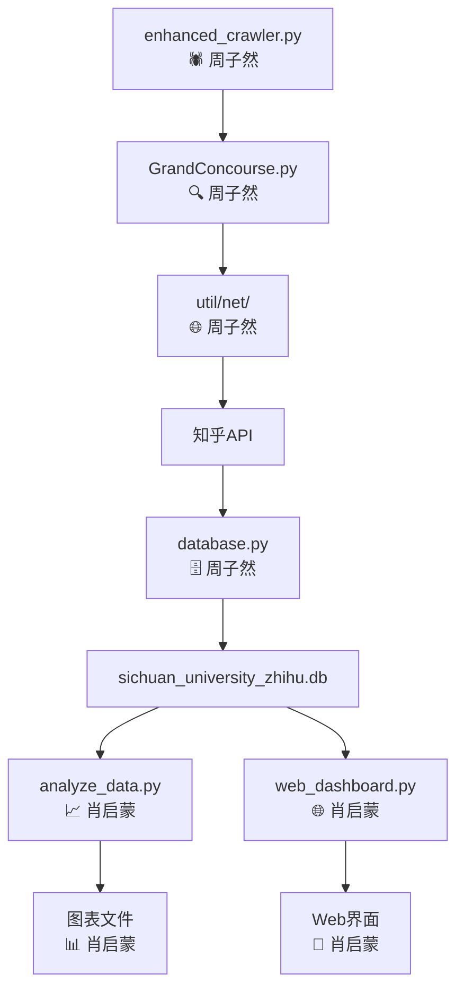

# 四川大学知乎数据爬虫项目

## 🎯 项目概述

本项目是一个专门针对四川大学相关内容的知乎数据采集与分析系统，采用 Python 开发，具备数据爬取、存储、分析和可视化展示功能。

## 👥 项目团队

| 成员 | 主要职责 | 负责模块 |
|------|----------|----------|
| **周子然** | 🕷️ 爬虫架构师 | 数据采集、反爬虫机制、数据库设计 |
| **肖启蒙** | 📊 数据分析师 | 数据分析、可视化、Web界面开发 |

### 📋 详细分工

#### 🕷️ 周子然 - 爬虫架构师
- **核心爬虫程序**: `enhanced_crawler.py` - 主爬虫逻辑和反爬虫机制
- **搜索引擎**: `GrandConcourse.py` - 数据搜索和采集功能
- **数据库设计**: `database.py` - SQLite 数据库操作和表结构设计
- **网络模块**: `util/net/` - 网络请求封装和API接口
- **工具库**: `util/parse/`, `util/timer/` - 数据解析和时间控制
- **项目架构**: 整体系统架构设计和模块划分

#### 📊 肖启蒙 - 数据分析师
- **数据分析**: `analyze_data.py` - 统计分析和图表生成
- **Web界面**: `web_dashboard.py` + `templates/dashboard.html` - 交互式数据展示
- **可视化图表**: 词云图、数据分析图表的设计和生成
- **文档编写**: `PROJECT_STRUCTURE.md` - 项目文档和说明
- **数据导出**: Excel 文件生成和数据格式化
- **用户体验**: Web界面设计和交互优化

## 📊 项目特性

- ✅ **多维度数据采集** - 话题、问题、用户、回答
- ✅ **智能去重机制** - 避免重复数据
- ✅ **数据可视化** - Web Dashboard + 图表分析
- ✅ **批量关键词搜索** - 提高数据覆盖率
- ✅ **数据导出** - 支持 Excel 和 SQLite 格式
- ✅ **反爬虫机制** - 智能延时和请求控制

## 📁 项目文件结构

```
C:.
│  .gitattributes                    # Git 配置文件
│  analyze_data.py                   # 📊 数据分析主程序
│  database.py                       # 🗄️ 数据库操作模块
│  enhanced_crawler.py               # 🕷️ 增强版爬虫主程序
│  GrandConcourse.py                 # 🔍 数据搜索引擎
│  PROJECT_STRUCTURE.md              # 📖 项目结构说明文档
│  requirements.txt                  # 📦 项目依赖清单
│  sichuan_university_zhihu.db       # 💾 SQLite 数据库文件
│  web_dashboard.py                  # 🌐 Web Dashboard 主程序
│  wordcloud.png                     # ☁️ 词云图输出文件
│  zhihu_data.xlsx                   # 📋 Excel 数据导出文件
│  zhihu_data_analysis.png           # 📈 数据分析图表
│
├─design
│      spider.xmind                  # 🧠 爬虫架构思维导图
|
├─diagram                            # ☁️ 架构图片
│
├─templates
│      dashboard.html                # 📱 Web Dashboard 模板
│
├─util                               # 🛠️ 工具库
│  │  document.py                    # 📄 文档处理工具
│  │  __init__.py                    # 🔧 包初始化文件
│  │
│  ├─const
│  │  │  __init__.py                 # 🔧 常量定义模块
│  │  └─__pycache__                  # 🐍 Python 缓存目录
│  │
│  ├─log
│  │  │  log.py                      # 📝 日志记录功能
│  │  │  record.py                   # 📝 记录操作功能
│  │  │  __init__.py                 # 🔧 日志模块初始化
│  │  └─__pycache__                  # 🐍 Python 缓存目录
│  │
│  ├─net
│  │  │  api.py                      # 🌐 API 接口定义
│  │  │  net.py                      # 🌐 网络请求封装
│  │  │  __init__.py                 # 🔧 网络模块初始化
│  │  │  知乎API.md                   # 📋 知乎API文档说明
│  │  └─__pycache__                  # 🐍 Python 缓存目录
│  │
│  ├─parse
│  │  │  guidance                    # 📋 解析指导文件
│  │  │  multilevel.py               # 🔨 多层数据解析工具
│  │  │  simple.py                   # 🔨 简单数据解析工具
│  │  │  __init__.py                 # 🔧 解析模块初始化
│  │  └─__pycache__                  # 🐍 Python 缓存目录
│  │
│  ├─timer
│  │  │  timer.py                    # ⏰ 时间控制模块
│  │  │  __init__.py                 # 🔧 时间模块初始化
│  │  └─__pycache__                  # 🐍 Python 缓存目录
│  │
│  └─__pycache__                     # 🐍 Python 缓存目录
│
├─zhihu                              # 🕷️ 知乎模块
│  │  utils.py                       # 🔧 知乎工具函数
│  │  __init__.py                    # 🔧 知乎模块初始化
│  │
│  ├─article
│  │  │  __init__.py                 # 📄 文章爬取模块
│  │  └─__pycache__                  # 🐍 Python 缓存目录
│  │
│  ├─collection
│  │      __init__.py                # 📚 收藏夹模块
│  │
│  ├─question
│  │  │  __init__.py                 # ❓ 问题爬取模块
│  │  └─__pycache__                  # 🐍 Python 缓存目录
│  │
│  ├─topic
│  │  │  __init__.py                 # 🏷️ 话题爬取模块
│  │  └─__pycache__                  # 🐍 Python 缓存目录
│  │
│  ├─user
│  │  │  __init__.py                 # 👤 用户爬取模块
│  │  └─__pycache__                  # 🐍 Python 缓存目录
│  │
│  └─__pycache__                     # 🐍 Python 缓存目录
│
└─__pycache__                        # 🐍 Python 缓存目录
```

## 📁 核心功能模块

### 🚀 数据采集模块 (周子然负责)

| 文件 | 功能描述 | 状态 |
|------|----------|------|
| **enhanced_crawler.py** | 🕷️ 增强版爬虫程序，具备反爬虫机制 | ✅ 核心 |
| **GrandConcourse.py** | 🔍 数据搜索引擎，实现各类数据的搜索功能 | ✅ 核心 |
| **database.py** | 🗄️ 数据库操作模块，负责 SQLite 数据存储 | ✅ 核心 |

### 📊 数据分析模块 (肖启蒙负责)

| 文件 | 功能描述 | 输出 |
|------|----------|------|
| **analyze_data.py** | 📈 数据分析脚本，生成统计报告和图表 | 图片+Excel |
| **web_dashboard.py** | 🌐 Web 可视化界面，提供数据分析 Dashboard | Web界面 |
| **zhihu_data_analysis.png** | 📊 数据分析可视化图表 | 图片文件 |
| **wordcloud.png** | ☁️ 关键词云图 | 图片文件 |
| **zhihu_data.xlsx** | 📋 导出的 Excel 数据文件 | Excel 文件 |

### 🗃️ 数据存储

| 文件 | 功能描述 | 容量 |
|------|----------|------|
| **sichuan_university_zhihu.db** | 💾 SQLite 数据库，存储所有爬取数据 | 2.3MB+ |

### 🎨 前端界面 (肖启蒙负责)

| 目录/文件 | 功能描述 | 技术栈 |
|-----------|----------|--------|
| **templates/** | 🎭 Web 模板文件夹 | HTML/CSS/JS |
| └── **dashboard.html** | 📱 数据可视化页面模板 | Chart.js |

### 🛠️ 工具库 (周子然负责)

| 模块 | 功能描述 | 主要文件 | 状态 |
|------|----------|----------|------|
| **net/** | 🌐 网络请求封装 | `net.py`, `api.py`, `知乎API.md` | ✅ 使用中 |
| **parse/** | 🔨 数据解析工具 | `simple.py`, `multilevel.py`, `guidance` | ✅ 使用中 |
| **log/** | 📝 日志记录系统 | `log.py`, `record.py` | ✅ 预留 |
| **timer/** | ⏰ 时间控制模块 | `timer.py` | ✅ 使用中 |
| **const/** | 🔧 常量定义 | `__init__.py` | ✅ 使用中 |
| **document.py** | 📄 文档处理工具 | 单文件 | ✅ 使用中 |

### 🕷️ 知乎模块 (周子然负责)

| 模块 | 功能描述 | 主要文件 | 状态 |
|------|----------|----------|------|
| **article/** | 📄 文章爬取功能 | `__init__.py` | 🔧 预留接口 |
| **question/** | ❓ 问题爬取功能 | `__init__.py` | ✅ 已实现 |
| **topic/** | 🏷️ 话题爬取功能 | `__init__.py` | ✅ 已实现 |
| **user/** | 👤 用户爬取功能 | `__init__.py` | ✅ 已实现 |
| **collection/** | 📚 收藏夹功能 | `__init__.py` | 🔧 预留接口 |
| **utils.py** | 🔧 通用工具函数 | 单文件 | ✅ 工具库 |

### 📋 配置文档

| 文件 | 功能描述 | 负责人 | 格式 |
|------|----------|--------|------|
| **requirements.txt** | 📦 项目依赖清单 | 共同维护 | Text |
| **PROJECT_STRUCTURE.md** | 📖 项目结构说明文档 | 肖启蒙 | Markdown |
| **.gitattributes** | 🔧 Git 配置文件 | 共同维护 | Git Config |

### 🎨 设计文档 (周子然负责)

| 目录/文件 | 功能描述 | 工具 |
|-----------|----------|------|
| **design/** | 🎨 设计文档文件夹 | - |
| └── **spider.xmind** | 🧠 爬虫架构思维导图 | XMind |

## 🚀 快速开始

### 1. 环境准备
```bash
pip install -r requirements.txt
```

### 2. 运行数据采集 (周子然模块)
```bash
# 推荐：使用增强版爬虫（具备反爬虫机制）
python enhanced_crawler.py

# 或使用搜索引擎测试
python GrandConcourse.py
```

### 3. 数据分析 (肖启蒙模块)
```bash
python analyze_data.py
```

### 4. 启动 Web Dashboard (肖启蒙模块)
```bash
python web_dashboard.py
# 访问 http://localhost:5000
```

## 📊 数据流程



## 🎯 采集目标与现状

| 数据类型 | 目标数量 | 当前状态 | 实际字段 |
|----------|----------|----------|----------|
| **话题** | 1,000+ | ✅ 221条 | name, followers_count, questions_count |
| **问题** | 5,000+ | ✅ 711条 | title, answer_count, follower_count |
| **用户** | 3,000+ | ✅ 301条 | name, follower_count, answer_count |
| **回答** | 8,000+ | ✅ 974条 | content, voteup_count, author_info |
| **总计** | 100,000+ | 🔄 2,331条 | 持续增长中 |

## 📈 性能指标

- ⚡ **采集速度**: 约 1,500 条/小时（安全模式）
- 💾 **数据准确性**: 智能去重，确保数据唯一性
- 🔄 **系统稳定性**: 异常处理和重试机制
- 📊 **可视化**: 实时 Web Dashboard + 静态图表
- 🛡️ **反爬虫**: 动态延时和请求频率控制

## 🛡️ 技术栈

| 层级 | 技术选型 | 用途 | 负责人 |
|------|----------|------|--------|
| **数据采集** | Python + Requests | 网络爬虫 | 周子然 |
| **数据存储** | SQLite | 本地数据库 | 周子然 |
| **数据分析** | Pandas + Matplotlib | 数据处理和可视化 | 肖启蒙 |
| **Web界面** | Flask + Chart.js | 交互式 Dashboard | 肖启蒙 |
| **前端** | HTML5 + CSS3 + JavaScript | 用户界面 | 肖启蒙 |
| **反爬虫** | 随机延时 + Session轮换 | 安全采集 | 周子然 |

## 📝 使用说明

### 🔧 推荐配置
1. **运行主程序**：使用 `enhanced_crawler.py`（具备完整的反爬虫机制）
2. **调整采集量**：修改关键词列表和 `max_results` 参数
3. **监控进度**：通过控制台输出实时查看采集状态

### 📊 数据查看
1. **SQLite**: 使用 DB Browser for SQLite 查看 `sichuan_university_zhihu.db`
2. **Excel**: 打开 `zhihu_data.xlsx` 查看导出数据
3. **Web界面**: 访问 http://localhost:5000 查看可视化分析
4. **图表**: 查看 `zhihu_data_analysis.png` 和 `wordcloud.png`

### 🔄 数据更新
重新运行 `enhanced_crawler.py` 即可累积更多数据，系统会自动去重。

## 📞 技术支持

- **数据库**: 9个表，支持完整的知乎数据结构
- **安全采集**: 动态延时，避免IP封禁
- **多次运行**: 支持累积式数据采集
- **实时监控**: Web Dashboard 实时显示采集状态

## 🏆 项目成果

### 📊 数据采集成果 (周子然)
- ✅ 实现智能反爬虫机制，避免IP封禁
- ✅ 设计完整的数据库结构，支持9个数据表
- ✅ 构建高效的搜索引擎，支持多维度数据采集
- ✅ 实现累积式数据采集，支持多次运行

### 📈 数据分析成果 (肖启蒙)
- ✅ 开发交互式Web Dashboard，实时展示数据分析结果
- ✅ 生成多类型可视化图表（词云图、统计图表等）
- ✅ 实现数据导出功能，支持Excel格式
- ✅ 编写完整的项目文档和使用说明

---

*项目版本: v2.0 (Enhanced) | 开发团队: 周子然 & 肖启蒙 | 最后更新: 2025年6月 | 当前数据: 2,331条*